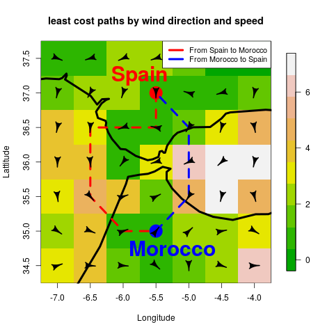

# rWind

[](https://github.com/KlausVigo/rWind/actions)
[](https://cran.r-project.org/package=rWind)
[](https://cran.r-project.org/package=rWind)
[](http://depsy.org/package/r/rWind)
[](https://app.codecov.io/gh/jabiologo/rWind)

## Overview

 rWind is a library in the R language for statistical computing and graphics (R Development Core Team), designed specifically to download and process wind and sea currents data from the Global Forecasting System. From these data, users can obtain wind/sea currents speed and direction layers in order to compute connectivity values between locations. There are other great R libraries that covers data download and data managing that could overlap with [rWind](https://cran.r-project.org/package=rWind), such us [rnoaa](https://cran.r-project.org/package=rnoaa), [RNCEP](https://cran.r-project.org/package=RNCEP) or [weatherr](https://CRAN.R-project.org/package=weatherr). However, rWind is specially focused to offer to the users a straightforward workflow from data download to cost analysis between locations. rWind fills the gap between wind/sea currents data accessibility and their inclusion in a general framework to be applied broadly in ecological or evolutionary studies.
 
 It has been peer-reviewed published in: Fernández‐López, J. and Schliep, K. (2019), rWind: download, edit and include wind data in ecological and evolutionary analysis. Ecography, 42: 804-810. https://doi.org/10.1111/ecog.03730  
https://onlinelibrary.wiley.com/doi/full/10.1111/ecog.03730  

 For more information about data source, please check: 

NOAA/NCEP Global Forecast System (GFS) Atmospheric Model colection (wind data)  
* <https://pae-paha.pacioos.hawaii.edu/erddap/info/ncep_global/index.html>

Ocean Surface Current Analyses Real-time (OSCAR) (sea currents data)  
* <https://coastwatch.pfeg.noaa.gov/erddap/info/jplOscar_LonPM180/index.html><br />

To install the latest released version of rWind on CRAN use `install.packages("rWind")`  
To install the latest development version `devtools::install_github("jabiologo/rWind")`  
  
  
  
### Quick example: Computing anisotropic shortest paths across Strait of Gibraltar

First, we load the main packages we will use in this example. This vignette 
was written under the rWind version `r foo$Version`

```{R}
# use install.packages() if some is not installed
# you can install the latest development version using the command 
# devtools::install_github("jabiologo/rWind")
library(rWind)
library(raster)
library(gdistance)
```


In this simple example, we introduce the most basic functionality of rWind, 
to get the shortest paths between two points across Strait of Gibraltar. Notice
that, as wind connectivity is anisotropic (direction dependent), shortest path
from A to B usually does not match with shortest path from B to A.

First, we download wind data of a selected date (e.g. 2015 February 12th). 

```{R}
w <- wind.dl(2015, 2, 12, 12, -7, -4, 34.5, 37.5)
```
Next we transform this `data.frame` into two raster layers, with values of wind
direction and wind speed.
```{R}
wind_layer <- wind2raster(w)
```

Then, we will use `flow.dispersion` function to obtain a `transitionLayer` 
object with conductance values, which will be used later to obtain the shortest
paths.
```{R}
Conductance<-flow.dispersion(wind_layer)
```

Now, we will use `shortestPath` function from `gdistance` package [@gdistance] 
to compute shortest path from our `Conductance` object between the two selected
points.
```{R}
AtoB<- shortestPath(Conductance, 
                    c(-5.5, 37), c(-5.5, 35), output="SpatialLines")
BtoA<- shortestPath(Conductance, 
                    c(-5.5, 35), c(-5.5, 37), output="SpatialLines")
```

Finally, we plot the map and we will add the shortest paths as lines and some
other features.

We need some additionally packages to be installed. This can be done using the 
command `install.packages(c("fields", "shape", "rworldmap"))`. 


```{R}
library(fields)
library(shape)
library(rworldmap)

image.plot(wind_layer$wind.speed, main="least cost paths by wind direction and speed", 
     col=terrain.colors(10), xlab="Longitude", ylab="Lattitude", zlim=c(0,7))

lines(getMap(resolution = "low"), lwd=4)

points(-5.5, 37, pch=19, cex=3.4, col="red")
points(-5.5, 35, pch=19, cex=3.4, col="blue")

lines(AtoB, col="red", lwd=4, lty=2)
lines(BtoA, col="blue", lwd=4, lty=2)

alpha <- arrowDir(w)
Arrowhead(w$lon, w$lat, angle=alpha, arr.length = 0.4, arr.type="curved")

text(-5.75, 37.25,labels="Spain", cex= 2.5, col="red", font=2)
text(-5.25, 34.75,labels="Morocco", cex= 2.5, col="blue", font=2)
legend("toprigh", legend = c("From Spain to Morocco", "From Morocco to Spain"),
    lwd=4 ,lty = 1, col=c("red","blue"), cex=0.9, bg="white")
```


  
  
For more information and examples, you can check [my blog](http://allthiswasfield.blogspot.com/2018/11/plotting-wind-highways-using-rwind.html)


